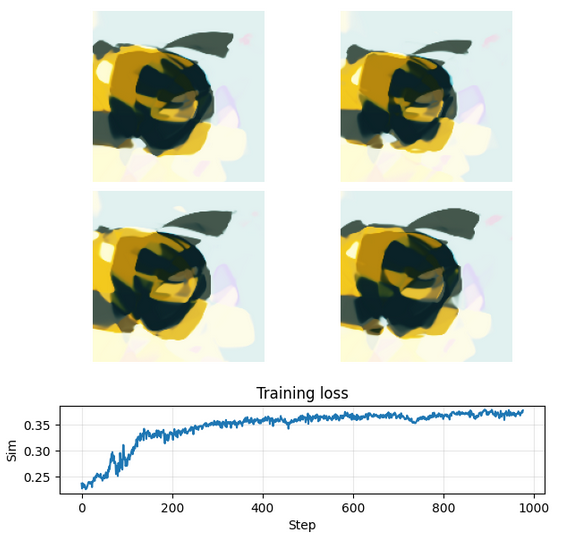

# Training CPPNs with CLIP

This repository contains code and resources for training Compositional Pattern Producing Networks (CPPNs) using OpenAI's CLIP model. CPPNs are a type of neural network that can generate complex patterns and images based on input parameters. By leveraging the power of CLIP, we can guide the CPPN to create images that align with specific textual descriptions.

Open the notebook [training.ipynb](training.ipynb) to train using end-to-end differentiation + backpropagation.

Open the notebook [training_evo.ipynb](training_evo.ipynb) to train using evolutionary strategies.

### Requirements

- pytorch + torchvision
- openAI CLIP `pip install git+https://github.com/openai/CLIP.git`

### Example
goal: `a bumblebee`
