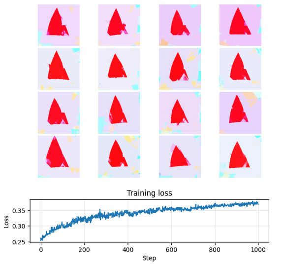

# Training CPPNs with CLIP

This repository contains code and resources for training Compositional Pattern Producing Networks (CPPNs) using OpenAI's CLIP model. CPPNs are a type of neural network that can generate complex patterns and images based on input parameters. By leveraging the power of CLIP, we can guide the CPPN to create images that align with specific textual descriptions.

Open the notebook [training.ipynb](training.ipynb) to train using end-to-end differentiation + backpropagation.

Open the notebook [training_evo.ipynb](training_evo.ipynb) to train using evolutionary strategies.

### Requirements

- pytorch + torchvision
- openAI CLIP `pip install git+https://github.com/openai/CLIP.git`

### Method
Maximizing the cosine similarity between the CLIP embeddings of the generated image and the target text.

**Differentiation method:** A single model is used, where the batch dimension is used to sample multiple latent vectors `z`, and can also be used to noise the coordinate space. Both methods add noise to the model and force it to perform in a broader range.

**Evolutionary strategy method:** A population of models are evolved using an evolutionary strategy (e.g. CMA-ES).

### Example
goal: `a bumblebee`\
method: `end-to-end differentiation`\

---

goal: `a red triangle`\
method: `evolutionary strategy`\
